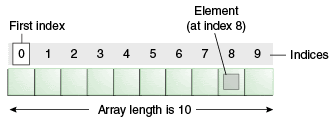
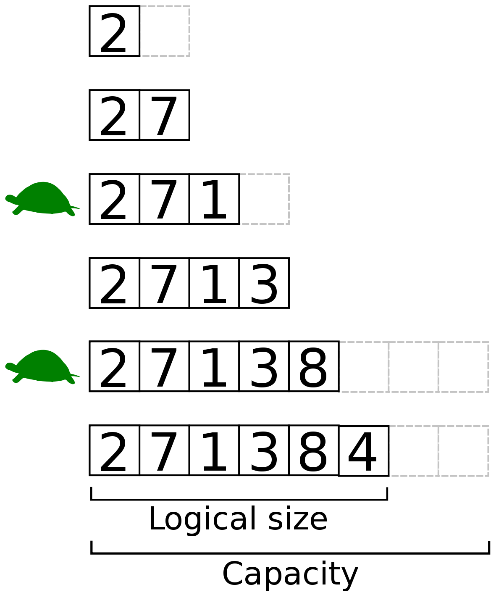

# Arrays in Data Structure

## How data will be stored in array?

In a linear collection which consisits of elements and auto indexes with index start from 0.



- Static Array 
- Dynamic Array

### Array Operations:

- Get
- Set
- Insert
    - Beginning
    - Middle
    - End
- Delete
    - Beginning
    - Middle
    - End
- Copy

## What Static Array?


**C - example**

```c
static int arrray[3] 
//or
int a[5] = {1,2,3,4,5}
```

**Java - example**

```java
String [] alphabets = new String[26]
```

For Example: Memory is 64 bit (Fixed Width) : 8 bytes. Each value will be stored in 8 bytes of memory which will be 8 memory slots

### Complexities

| Operation | Complexity | Comments|
| ------------- | ------------- |------------- |
| Get       | O(1) | Index is known to memory. No iteration required|
| Set       | O(1) | Index is known to memory. No iteration required|
| Insert       | O(n) | Index is known to memory. No iteration required|
| - Begining       | O(n) | Iteration required to right shift the elements in an array|
| - Middle       | O(n) | Iteration required to right shift the elements in an array|
| - End       | O(n) | Iteration required |
| Delete       | O(n) | Index is known to memory. No iteration required|
| - Begining       | O(n) | Iteration required to left shift the elements in an array|
| - Middle       | O(n) | Iteration required to left shift the elements in an array|
| - End       | O(1) | Index is known to memory. No iteration required|
| Copy       | O(n) | Iteration required to allocate|

## What Dynamic Array?

The Array memory size are allocated double the time during the initialization process.



Javascript

```js
var a = [1,2,3]
```
 
For Example: Memory is 64 bit (Fixed Width) : 8 bytes. Each value will be stored in 8 bytes of memory which will be 8 memory slots


| Operation | Complexity | Comments|
| ------------- | ------------- |------------- |
| Get       | O(1) | Index is known to memory. No iteration required|
| Set       | O(1) | Index is known to memory. No iteration required|
| Insert       | O(n) | Index is known to memory. No iteration required|
| - Begining       | O(n) | Iteration required to right shift the elements in an array|
| - Middle       | O(n) | Iteration required to right shift the elements in an array|
| - End       | O(1) | Index is known to memory. No iteration required (check reference:Amortized complexity) |
| Delete       | O(n) | Index is known to memory. No iteration required|
| - Begining       | O(n) | Iteration required to left shift the elements in an array|
| - Middle       | O(n) | Iteration required to left shift the elements in an array|
| - End       | O(1) | Index is known to memory. No iteration required|
| Copy       | O(n) | Iteration required to allocate|

**3 Operations performed**

1. Copy
2. Allocate
3. Get/Set/Put/Post/Copy

Reference: https://www.youtube.com/watch?v=MTl8djZFWE0