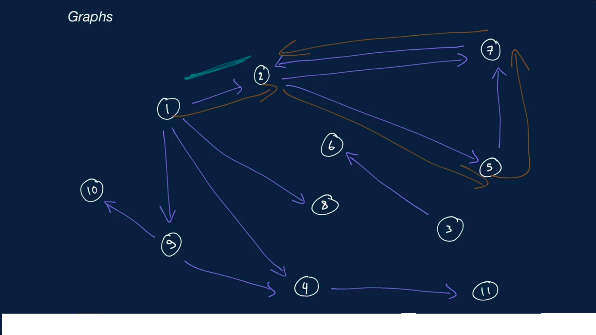

    <b><a href="README.md">↥ back to Index</a></b>

Table of Contents
=================

   * [Graph in Data Structure](#graph)
      * [Terminologies](#terminologies)
      * [Classification](#classification)
      * [Traversal](#traversal)
      * [Time and Space Complexity](#time-and-space-complexity)

# Graph

## Terminologies 

- Node or Vertex
  - A fundamental unit of which Graphs are formed.  
- Vertices
  - The collection of nodes or vertex is called Vertices.
- Edges
  - The Relationship between the vertices are called Edges.
- Realtime Example
  - A city map can be represented by graph whose vertices are location in the city 
    and whose edges are road between the locations      

## Classification  

- Undirected graph
  - A graph whose edges are undirected meaning they can traverse in both the directions. For example) A graph of friendship is 
     undirected graph.
     - Watch the edge connecting 2 and 7 in the graph diagram.
- Directed Graph
  - A graph whose edges are directed meaning they can traverse only in one direction.
     - Watch the edge connecting 1 and 2 in the graph diagram.
- Acyclic Graph
  - A graph who has no cycles.
      - Watch the vertices (1,8), (1,9) and (1,4)  in the graph example
- Cyclic Graph
  - A graph who has at least one cycle.
      - Watch the vertices (2,7), (7,5) and (5,2)  in the graph example
- Connected Graph(Strongly Connected)
  - A graph is connected meaning if one or more edges connecting the given vertices.
     - Watch the vertices (2,7), (7,5) and (5,2)  in the graph example.
- Disconnected Graph(Weakly connected) 
  - A graph is disconnected meaning if there are connections between the vertices of every pair of vertices.
      - Watch the Vertices (6,3) in the graph example is disconnected from the (1,8) vertex.

## Traversal

- Depth First Traversal 
     - DFT uses Depth First Search approach before traversing the sibling node child node need to traverse.
     
          

- Breadth First Traversal
     - BFT uses Breadth First Search approach firstly the sibling node need to be traverse and Secondly, child node need to traverse.
  
      

## Time and Space Complexity

| Operation |  Complexity |
| ------------- | ------------- |
| Adding the vertex/Edge | o(v + E) |
| Removing the vertex/Edge | o(v + E) |

