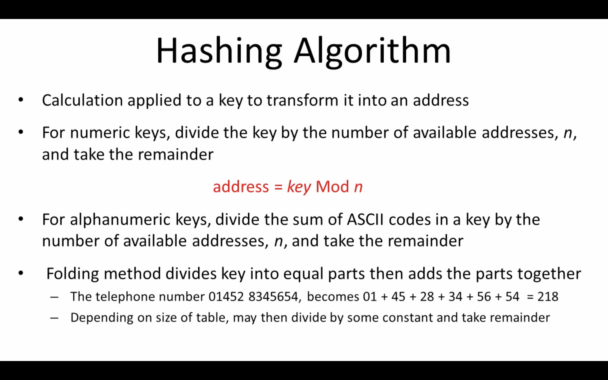
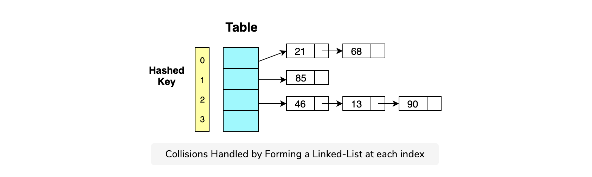

# HashTable

Hash table is a fast datastruture. Hash table will be a `key:value` pair where key is considered mostly as a `Alphanumeric`. Under the hood HashTable uses a dynamic array of linkedlist to efficiently store key, value pair.

*Example of Hash Table in Javascript*
```js
let a = ["peter": {"name":"peter","salaryPercetage":10},"shan": {"name":"shan","salaryPercetage":20}]
```

It uses hashing technique to store the data in the memory. Most general hasing technique used is converting the string to ASCI code.

`Index number =  (sum ASCII codes) mod (size of array)`

## Hashing is implemented in two steps:

1. An element is converted into an integer by using a hash function. This element can be used as an index to store the original element, which falls into the hash table.
The element is stored in the hash table where it can be quickly retrieved using hashed key.
```
hash = hashfunc(key)
index = hash % array_size
```
2. In this method, the hash is independent of the array size and it is then reduced to an index (a number between 0 and array_size − 1) by using the modulo operator (%).



## Hash table collisions
Sometimes, a hash function can generate the same index for more than one key. This scenario is referred to as a hash collision. Collisions are a problem because every slot in a hash table is supposed to store a single element.

Hash collisions are usually handled using four common strategies.

**Linear probing:** Linear probing works by skipping over an index that is already filled. It could be achieved by adding an offset value to an already computed index. If that index is also filled, add it again and so on.

One drawback of using this strategy is that if you don’t pick an offset wisely, you can jump back to where you started and miss out on so many possible positions in the array.


**Chaining:** In the chaining strategy, each slot of our hash table holds a pointer to another data structure such as a linked list or a tree. Every entry at that index will be inserted into the linked list for that index.

As you can see, chaining allows us to hash multiple key-value pairs at the same index in constant time (insert at head for linked lists). This strategy greatly increases performance, but it is costly in terms of space.



## Time and Space Complexity

| Operation | Avg Complexity |  Worst Complexity |
| ------------- | ------------- |------------- |
| Inserting a key/value pair | O(1) |  O(n) |
| Removing a key/value pair| O(1) |  O(n) |
| Looking up a key | O(1) |  O(n) |

## Uses of hash tables

Hash tables provide access to elements in constant time, so they are highly recommended for algorithms that prioritize search and data retrieval operations. Hashing is ideal for large amounts of data, as they take a constant amount of time to perform insertion, deletion, and search.

In terms of time complexity, the operation is 0(1)0(1). On average, a hash table lookup is more efficient than other table lookup data structures. Some common uses of hash tables are:

- Database indexing
- Caches
- Unique data representation
- Lookup in an unsorted array
- Lookup in sorted array using binary search

## Referencese

- https://www.youtube.com/watch?v=KyUTuwz_b7Q
- https://www.educative.io/blog/data-strucutres-hash-table-javascript
