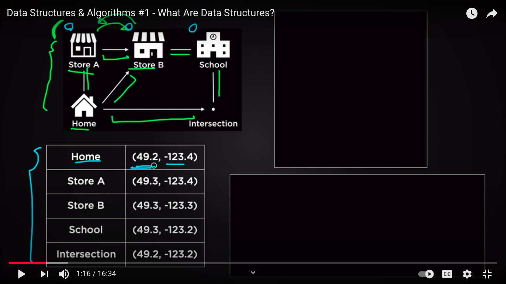
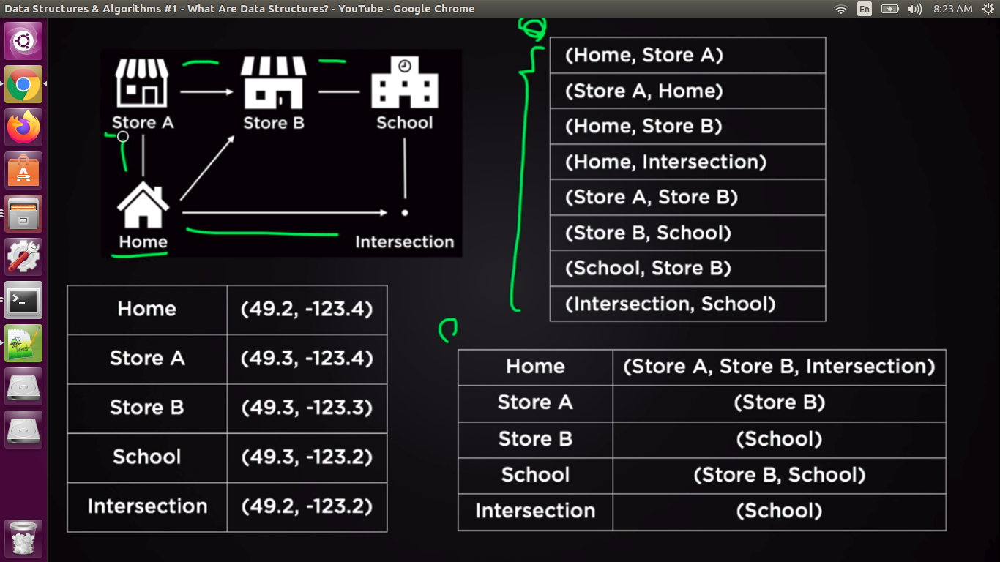
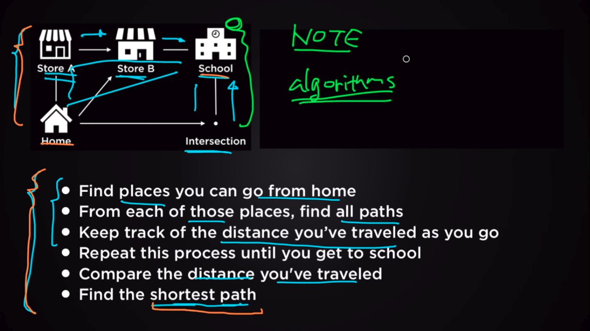

# Introducton to Data Structure and Algorithms
## Why we need Data Structure?
To examine the problem solving skills and for the following  skills

- Basics of coding 
- Foundational data strucutures(Math and Complexity)

## Data Structures

Data Structures is organizing/structuring/managing the data in the memory and it is collection of data values and relationship between the data values in which common operations can be applied. 

### Classification

- Primitive Data Structures
- Non Primitive Data Structures

#### Primitive

Dillinger uses a number of open source projects to work properly:

- Int
- Float
- Char
- Pointer
- Boolean

#### Non Primitive

-  Linear(Sequential)
	- Stack
		- Vector
		- Array
	- Queue
		- Priority Queue
		- List
			- Single linked list
			- Double linked list
			- Circular linked list
	

- Non Linear(Random)
	- Trees 
	- Binary 
	- Binary Search Tree
	- Graph
	- Map
		- HashMap
		- TreeMap
	- Set
		- HashSet
		- TreeSet

### Common Operations performed

- Searching
- Sorting
- Insertion
- Updation
- Deletion

##  Algorithm

A set of instructions or steps that applies on the data strucutures to solve a problem. 

### Problem Statement

-  The problem states that to find the best path between the two points source(home) to destination(school) having  he possible number of paths in the image.

### Identify Datastruture 

-  Array
-  HashTable

### Define Algorithm and apply

-  Efficiency of Algorithm depends upon the DataStructure

