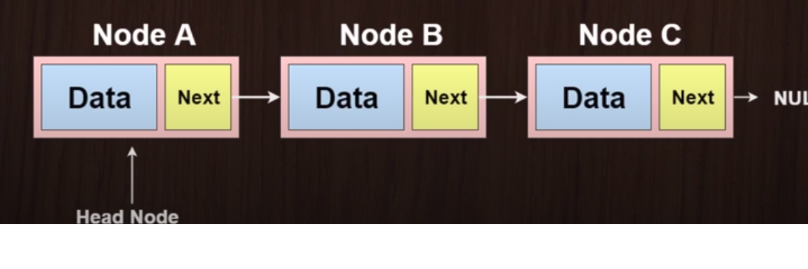
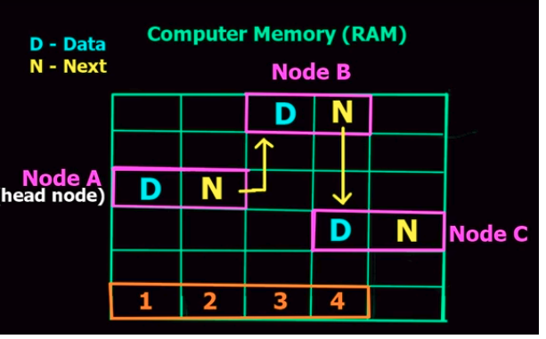
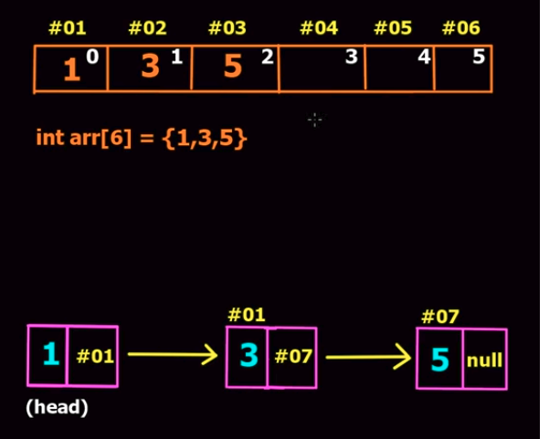
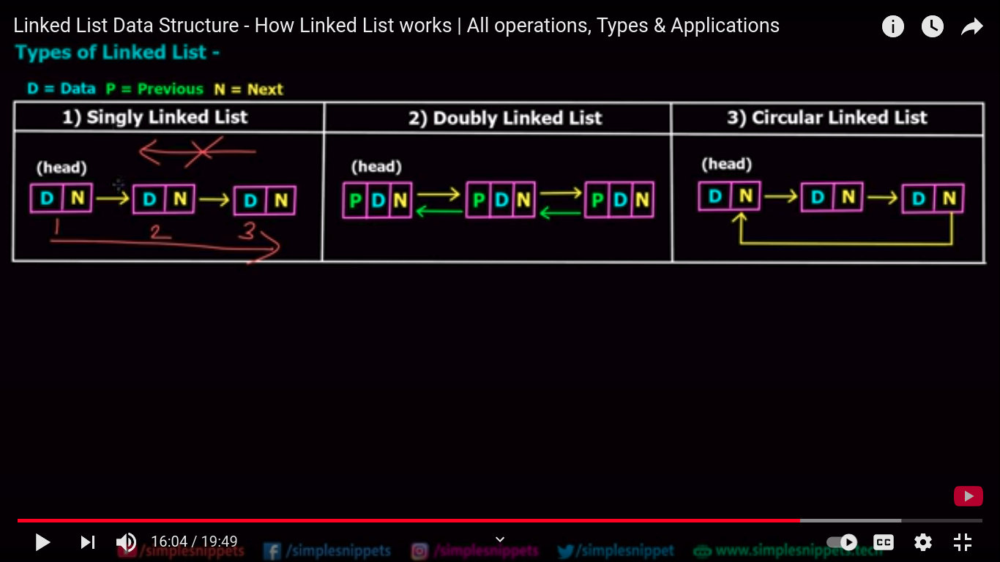
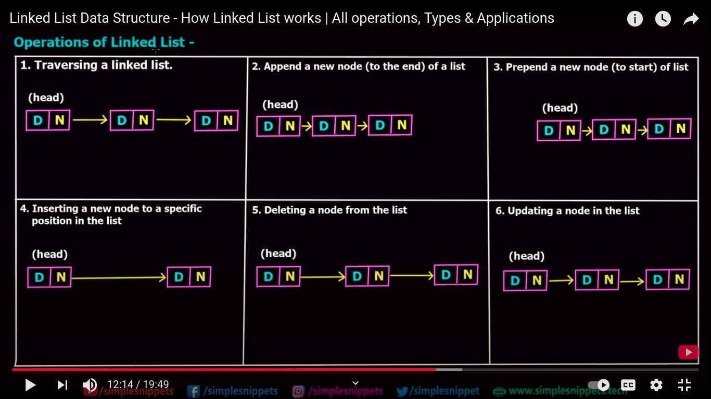

# LinkedList in Data Structure

## What is the linked list ? 

A linked list is a collection of linear data structure in which elements are not stored in the contiguous memory locations.

- Each Node contains data and address of next node.
- Head is First Node and the tail is the last Node.

##  Memory Storage

##  linked list vs Array 

### Pros

- Dynamic Size in Memory
- Ease of insertion or deletion

### Cons

- Random access is not allowed only sequential access
- Extra memory space for the pointer

## Linked List Types:

- Singly Linked List
- Doubly Linked List
- Circular Linked List

## Linked List Operations:

| Operation | Complexity - Singly Linked List |  Complexity - Doubly Linked List|
| ------------- | ------------- |------------- |
| Accessing the head  | O(1) |  O(1) |
| Accessing the tail    | O(n)  |  O(1)  |
| Accessing a middle  | O(n) | O(n) |
| Inserting / Removing the head | O(n) | O(1) |
| Inserting / Removing the tail | O(n) to access + O(1) | O(1) |
| Inserting / Removing a node | O(n) to access + O(1) | O(n) to access + O(1)  |
| Searching for a value | O(n) | O(n) |

## Practical Use case:

-  Undo and Redo operations in the OS clipboard follows the Linked List Datastructure.

Reference: https://www.youtube.com/watch?v=IJrQCCmuaqc
