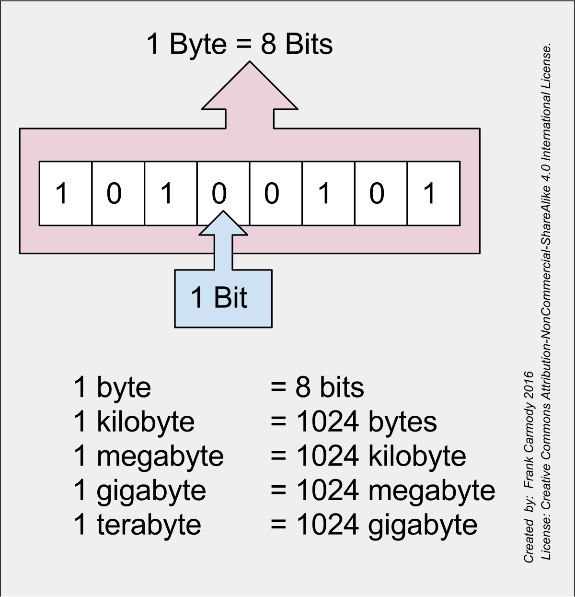

    <b><a href="README.md">↥ back to Index</a></b>

Table of Contents
=================

   * [Memory](#memory)
      * [First things first - Basic](#first-things-first---basic)
         * [What is Bit?](#what-is-bit)
         * [What is a Byte?](#what-is-a-byte)
         * [What is Fixed-Width integer?](#what-is-fixed-width-integer)
      * [Important points to note on Memory](#important-points-to-note-on-memory)

# Memory

The bedrock of all data structures, memory is the underlying concept that you absolutely need to know in order to understand why data structures work the way they do.

## First things first - Basic

### What is Bit?

- 1 bit is 0 or 1 - single pattern
- 2 bits is 00 or 01 or 11 or 10 - 4 pattern
- 3 bits is 000 , 0001, ...  - 8 pattern

### What is a Byte?

A byte is 8 bits. A byte considered as a unit of memory size. A single byte can represent upto 256 data values( 28)

### What is Fixed-Width integer?

An integer represented by fixed amount of bits. For example, a **32-bit integer** is an integer representation by 32 bits(4 Bytes), and a **64-bit integer** is an integer reprensentation by 64 bits (8 Bytes).

## Important points to note on Memory

- Data stored in memory is stored in bytes and, by extension, bits.
- Bytes in memory can "point" to other bytes in memory, so as to store references to other data.
- The amount of memory that a machine has is bounded, making it valuable to limit how much memory an algorithm takes up.
- Accessing a byte or a fixed number of bytes (like 4 bytes or 8 bytes in the case of **32-bit** and **64-bit integers**) is an elementary operation, which can be loosely treated as a single unit of operational work.
