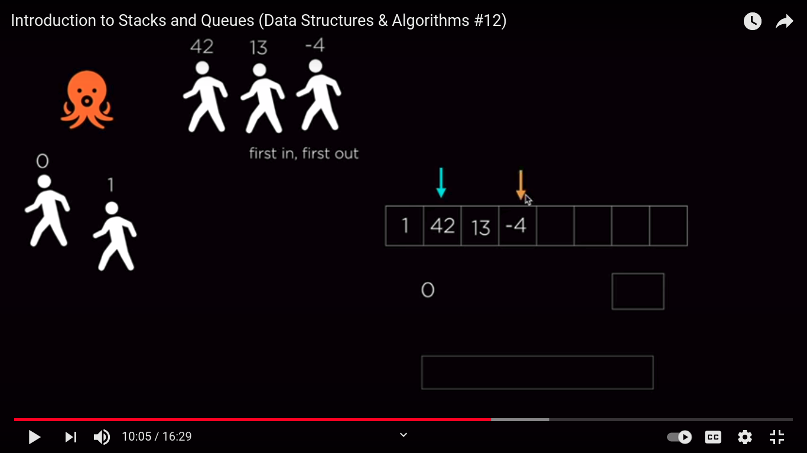

    <b><a href="README.md">↥ back to Index</a></b>

Table of Contents
=================

   * [Queue in Data Structure](#queue)
      * [Basic Operations](#basic-operations)
      * [Time and Space Complexity](#time-and-space-complexity)
      * [Example](#example)

# Queue

An array like data structure, whose element follow the FIFO(Last In First Out) rule

## Basic Operations

- Enqueue
  - The element is pushed at the end of the queue
- Dequeue 
  - The element is removed from the front of the queue
- peep
  - To find n th element from queue.

## Time and Space Complexity

| Operation |  Complexity |
| ------------- | ------------- |
| Enqueue an element | O(1) |  
| Dequeue an element| O(1) |
| Peek an element at front of the queue | O(1) |
| Search an element | O(n) |

## Example

- Doubly Linked List

