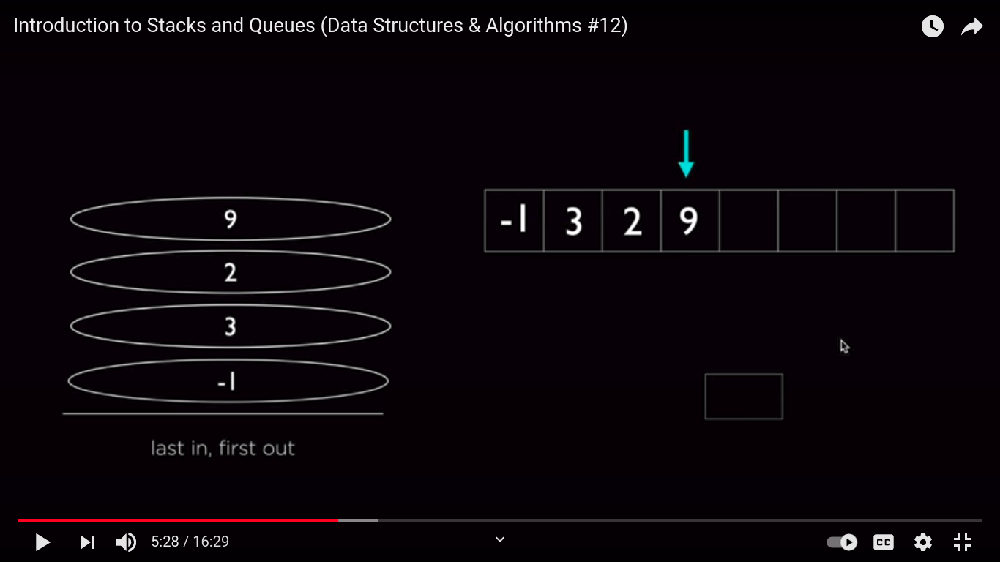
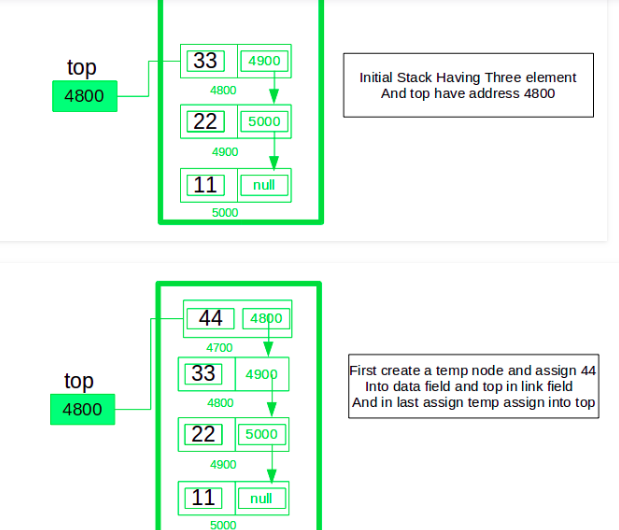

# Stack

An array like data structure, whose element follow the LIFO(Last In First Out) rule

## Basic Operations

- push
- pop 

## Time and Space Complexity

| Operation |  Complexity |
| ------------- | ------------- |
| Pushing an element | O(1) |  
| Pop an element| O(1) |
| Peek an element at top | O(1) |
| Search an element | O(n) |

## Example

- Singly Linked List

