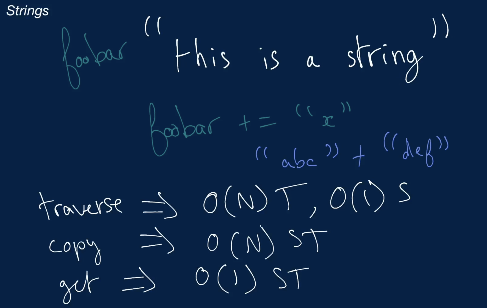

Table of Contents
=================

   * [Table of Contents](#table-of-contents)
   * [Strings](#strings)
      * [Memory Allocation](#memory-allocation)
      * [Mutable and Immutable](#mutable-and-immutable)
      * [Basic Operations](#basic-operations)

# Strings

Strings is a data type and it has operations like traverse, copy, get and so on. So these Strings operations involves Time and Space complexity. 

Strings uses Array data structure to store the data inside the memory bound.

## Memory Allocation

All strings are generally represented in English alphabets. So ASCII character encoding standard is used for storing the data in an Array inside memory bound.

```
ASCII uses 1 byte of 8 bits
```

In case of different languages say Chinese then it uses different character encoding standards to store the data in an Array which will occupy different memory slots.

## Mutable and Immutable

Strings implementation varies in different languages. In C++ Strings are mutable whereas in other languges like Java, JavaScript, Python ...etc Strins are immutable in nature. Strings behave much like normal arrays, with the main distinction being that, in most programming languages (C++ is a notable exception), strings are
<b>immutable</b>, meaning that they can't be edited after creation. This also means that simple operations like appending a character to a string are more
expensive than they might appear.

Immutable means original string is not modified on any operation rather it creates new String on top of the operations.

```py
string = "this is a string"
newString = ""

for character in string:
    newString += character
```

  The operation above has a time complexity of <b>O(n<sup>2</sup>)</b> where n
  is the length of <span>string</span>, because each addition of a character to
  <span>newString</span> creates an entirely new string and is itself an
  <b>O(n)</b> operation. Therefore, n O(n) operations are performed, leading to
  an O(n<sup>2</sup>) time-complexity operation overall.

For conctenating the string it is better to use Array to traverse and achieve the functionality instead of concatenate using `+` operation.




## Basic Operations

| Operation | Time Complexity  |  Space Complexity |
| ------------- | ------------- |------------- |
| Traverse  | O(n) |  O(1) |
| Copy   | O(n)  |  O(n)  |
| Get  | O(1) | O(1) |

